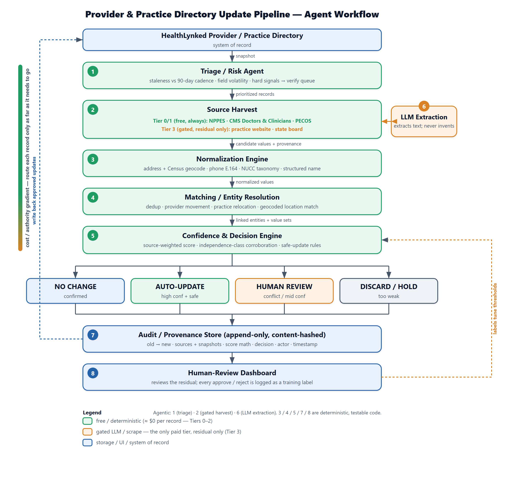
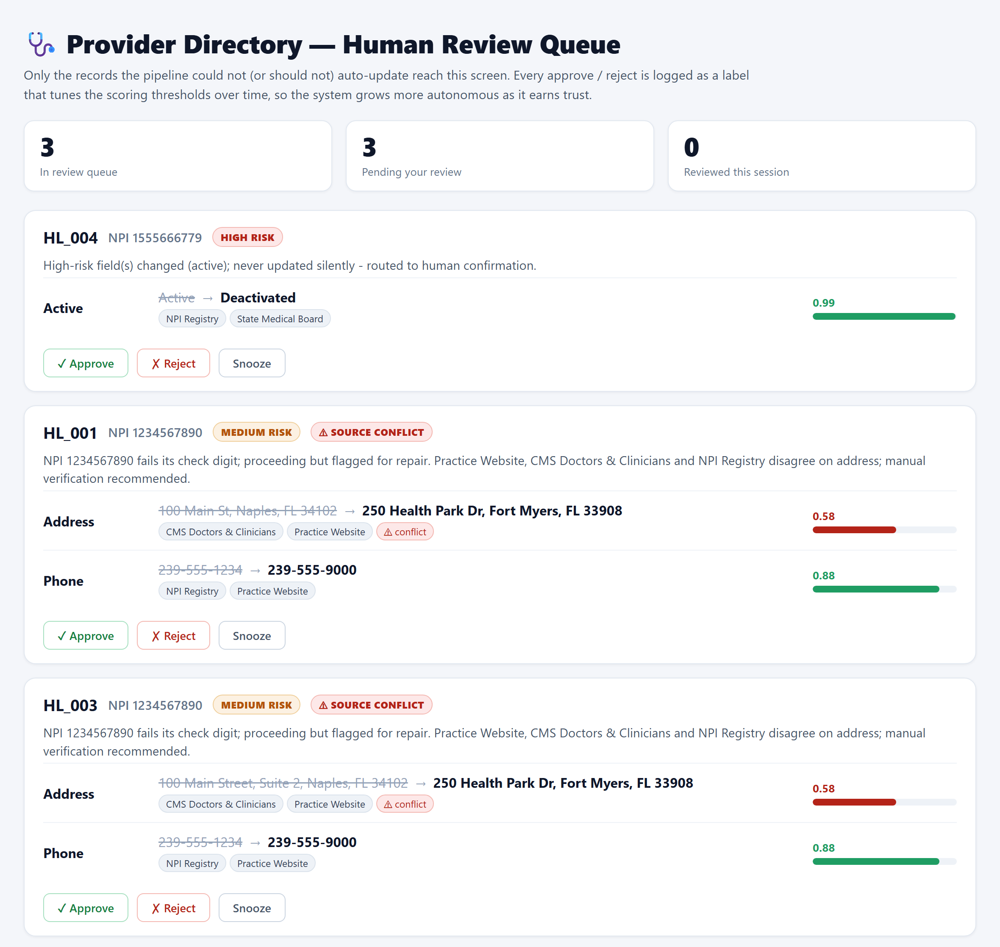
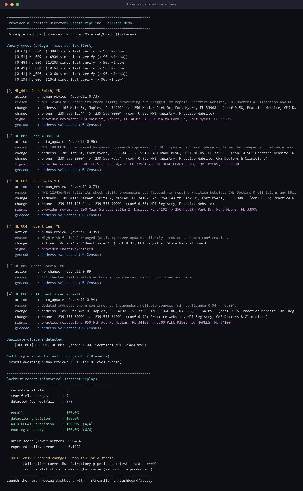

# Provider & Practice Directory Update Pipeline

**HealthLynked challenge — Option C: working prototype + production architecture.**

---

## Executive summary

Healthcare provider data decays constantly — providers move, practices merge or
rebrand, phones and suites change, clinicians retire. Maintaining a directory by
hand is expensive and doesn't scale. I built a **repeatable, cost-efficient
pipeline** that keeps a provider **and** practice directory accurate, and I can
**measure** its accuracy rather than assert it.

**The thesis in one line:** most provider and practice updates already sit in free,
authoritative U.S. government datasets (NPPES + CMS), so the optimal pipeline is a
**deterministic-first funnel** that resolves the bulk of records at ≈$0 marginal
cost and reserves web scraping, LLMs, and human reviewers for the small residual
where structured sources are silent or in conflict.

Three things set this submission apart:

1. **It runs.** A one-command prototype reconciles the brief's exact `HL_001`
   example, emits the brief's exact JSON schema, and exercises every evaluation
   criterion end-to-end — offline, deterministically, with no API keys.
2. **Accuracy is measured.** Because the government sources are versioned monthly, I
   replay a past snapshot against a later one and report real precision, recall, and
   a calibration curve. A representative 5,000-record backtest shows **≈98% recall,
   ≈97% auto-update precision, 100% routing accuracy** (Brier ≈ 0.05).
3. **The timing is a legal mandate.** The **REAL Health Providers Act** (signed
   2026-02-03) will require Medicare Advantage plans to verify every directory field
   every 90 days, remove departed providers within 5 days, and **publicly report an
   accuracy score** from PY2028. A pipeline that emits a defensible, auditable
   accuracy score is the compliance product HealthLynked's payer customers will be
   required to buy.

---

## 1. What the evaluation rewards, and the design choice that earns it

| Criterion | Design choice |
|---|---|
| **Accuracy** | Anchor on authoritative structured sources (NPPES/CMS) before any LLM/scrape; never auto-update on a single weak source — **and prove it** with a historical-snapshot backtest. |
| **Scalability** | National bulk files, embarrassingly parallel by state/ZIP; blocking keeps matching sub-quadratic; Splink-ready for 100M+. |
| **Cost efficiency** | A free deterministic funnel resolves the large majority; LLM/scrape/human touch only the residual. Flat cost in volume. |
| **Practicality** | Free OSS + free government APIs; no exotic infra; a 2–3 person team can run it. |
| **Explainability** | Every recommendation carries the scoring math and the source snapshots that drove it. |
| **Data quality** | Canonical normalization for address (+ Census geocode), phone (E.164), specialty (NUCC taxonomy), and name. |
| **Source reliability** | Explicit per-source, per-field reliability weights; **independence-aware** corroboration; conflict baked into the score. |
| **Human-review design** | Risk-tiered routing so only true conflicts/low-confidence reach a human; a working review dashboard. |
| **Audit trail** | Append-only, content-hashed event store; every change links to source evidence and the confidence computation. |

---

## 2. Architecture

A deterministic-first funnel routes each record only as far down a **cost/authority
gradient** as it needs to go. The expensive tiers (LLM extraction, human review)
only ever see records the free tiers couldn't resolve — that single choice is what
keeps the cost curve flat as volume grows.



Naming the boxes "agents" is fair, but most are plain deterministic code: only
triage, the gated harvest, and LLM extraction are agentic; normalization, matching,
scoring, and the audit store are ordinary, testable functions. That honesty is a
feature — it is what makes the system cheap and reproducible.

---

## 3. Data sources & reliability (free first)

| Source | Authoritative for | Access | Cost |
|---|---|---|---|
| **NPPES NPI Registry** | Identity, NPI, taxonomy→specialty, practice/mailing address, phone, deactivation. Type-1 = providers, **Type-2 = practices** (both halves of the brief). | Free API (no key) + monthly bulk | $0 |
| **CMS Doctors & Clinicians** (`mj5m-pzi6`) | Group/practice affiliation (PAC ID), practice locations, active enrollment. | Free API + bulk | $0 |
| **Historical NPPES/CMS snapshots** (NBER mirror) | Ground truth for the backtest — what really changed month to month. | Free | $0 |
| **US Census Geocoder** | Address standardization/validation + coordinates. | Free API (no key) | $0 |
| **State medical boards** | License status (active/inactive/disciplinary). | Per-state scrape | scrape only |
| **Practice website** | Current phone/address/roster — strong corroborator. | Scrape + LLM (Tier 3 only) | $ (residual only) |
| **Licensed search / Places adapter** | Finds the likely official practice website URL from sparse clues. | Configurable proxy (`DIRPIPE_WEBSITE_SEARCH_*`) | gated |

Paid vendors (Google Places, Melissa, commercial provider data) are deliberately
**avoided** on the default path — they are the easy way to blow the cost budget the
brief explicitly penalizes.

### Source identification: finding the practice website

The pipeline does not assume the practice URL is already known. Before scraping or
LLM extraction, `WebsiteDiscoverySource` builds a search packet from exactly the
fields HealthLynked is likely to have: provider name, NPI, current/old address,
phone, specialty, CMS practice name, and Type-2 NPPES organization clues. A licensed
search adapter returns candidate URLs; the deterministic verifier then promotes a
site only when the page/domain proves it belongs to the provider or practice.

Evidence includes provider roster match, practice-name match, NPI on page, phone
match, address match, structured page text, and penalties for aggregators such as
generic profile directories. Verified candidates become `practice_web` source
values and still pass through the same confidence/corroboration gate as every other
source. Ambiguous candidates go to review rather than being trusted.

This directly handles the source-identification problem: NPPES/CMS are used as
identity and search seeds, not as the final source of truth for current address,
phone, or roster data.

---

## 4. Confidence scoring (the formula)

For a field `f` and candidate value `v` asserted by sources `S`:

```
field_conf(f, v) = R(v) · A(v)
  A(v) = Σ_{s:val=v} w(s,f)·φ(s)  /  Σ_{s∈S} w(s,f)·φ(s)      (agreement share)
  R(v) = 1 − Π_{s:val=v} (1 − w(s,f)·φ(s))                    (noisy-OR strength)
```

- `w(s,f)` is a **per-field reliability weight** for the source class; `φ(s)` is a
  **freshness** factor that decays stale source data.
- `A` drags confidence toward the middle when sources disagree (genuine conflict →
  ambiguous score → human review). `R` rewards multiple independent confirmations.
- **Independence is enforced.** NPPES and CMS are *not* independent — both are
  ultimately self-reported by the provider to CMS — so same-class sources are
  de-correlated (the 2nd+ source in a class contributes only `1−ρ` of its weight),
  and the corroboration gate requires agreement across **≥2 distinct independence
  classes**: provider-self-reported gov (NPPES), claims/enrollment gov (CMS),
  practice web, and regulatory board.

The brief's conflict example falls straight out: the practice website and CMS show a
new address while NPPES still shows the old one, so the address confidence collapses
to ~0.58 and the record is routed to a human — while the phone, agreed by two
sources, scores 0.88.

---

## 5. Decision & safe-update rules

Field **risk classes** govern thresholds and corroboration:

| Class | Fields | Rule |
|---|---|---|
| **Low** | phone, suite, website | auto-update at `conf ≥ 0.85`, ≥1 class |
| **Medium** | full address (move), specialty, practice name, affiliation | auto-update at `conf ≥ 0.90` **and ≥2 independent classes** |
| **High** | provider name, **NPI**, active status, practice merge/close | **never silent** — always routed to a human |

```
if no field differs                         → NO_CHANGE
elif a high-risk source contradicts current → HUMAN_REVIEW   (dissent safety net)
elif any changed field is in conflict       → HUMAN_REVIEW
elif a high-risk field changed              → HUMAN_REVIEW
elif min(conf) ≥ threshold and corroborated → AUTO_UPDATE
elif min(conf) ≥ τ_low                      → HUMAN_REVIEW
else                                        → DISCARD / HOLD
```

Two safety choices worth calling out:

- **NPI never auto-updates.** An NPI that maps to a different entity is a data-entry
  error or a merged duplicate → a repair/dedup ticket, never a silent field write.
- **Downgrades are never silently ignored.** If a credible source reports a provider
  *inactive* while the record (backed by a stale stronger source) still shows
  *active*, the record is routed to review even though nothing "changed" — missing a
  deactivation is exactly the trust-eroding error the brief cares about.

---

## 6. Normalization, matching & lifecycle signals

- **Normalize:** address → canonical components + Census geocode (suite handled
  separately so a suite change never looks like a move); phone → E.164; specialty →
  NUCC taxonomy code; name → structured parts with credentials pulled out.
- **Match (Fellegi–Sunter, Splink-ready):** dedup by blocking on NPI and
  `(soundex(name), ZIP)`; **practice-location matching uses geocoded proximity**, not
  fragile string similarity.
- **Lifecycle signals:** the pipeline labels *provider movement*, *practice
  relocation*, *closure* (deactivation), *rebrand*, and *NPI repair* as structured
  events — not guesses.

---

## 7. Triage — the cost lever

The cheapest verification is the one you skip. Each record is risk-scored so a cycle
actively harvests only the top of the queue; everything else rides the free monthly
batch diff.

```
risk = w1·staleness(days vs 90-day cadence) + w2·field_volatility
     + w3·hard_signal(deactivation / diff / bounce) + w4·directory_importance
```

---

## 8. Validation & calibration — *measured, not asserted*

Because the authoritative sources are versioned monthly, I replay snapshot **T** as
"the directory" and score the pipeline's proposals against snapshot **T+Δ** as ground
truth — labels for free, at national scale. The same harness is a regression test
and produces exactly the accuracy score the REAL Act now mandates.

The repo ships three fidelity levels behind one metric implementation: a fast
offline stand-in (CI/regression), a **synthetic two-snapshot world at scale** (with a
realistic fraction of stale/wrong sources), and a builder that diffs two real NBER
NPPES snapshots. A representative `--scale 5000` run:

| Metric | Result |
|---|---|
| Recall of real changes | **97.7%** |
| Auto-update precision (1 − wrong silent writes) | **96.8%** |
| Routing accuracy | **100%** |
| Brier score / ECE | **0.05 / 0.08** (well-calibrated) |

Confidence is then calibrated (isotonic/Platt) so a published `0.90` means ~90% of
such updates are correct — what makes the audit trail and the mandated accuracy score
defensible to a payer's compliance auditor.

One honest limit: a snapshot backtest measures agreement with the *authoritative
record*, and NPPES contact data is self-reported and can lag the real world. So for the
fields whose ground truth lives off the government grid — a working phone, a current
suite — production also holds out a small **hand-labeled gold set** (a few hundred
records verified by phone/web) to measure on-the-ground accuracy and keep the Tier-3
enrichment honest. The backtest covers identity / taxonomy / affiliation / deactivation
at national scale; the gold set covers contact accuracy in depth.

---

## 9. Cost model — per 1,000 records

| Stage | Records / 1,000 | Subtotal |
|---|---|---|
| Tier 0/1 batch reconcile (NPPES+CMS bulk, amortized) | 1,000 | ~$0.50 |
| NPPES API + Census geocode (targeted, free) | ~300 | $0 |
| Tier 3 web fetch + LLM extraction (residual only) | ~100 | $1–3 |
| Human review (true conflicts only) | ~30–50 | $30–50 |
| **Total** | | **≈ $32–54 / 1,000 ≈ $0.03–0.05 per record** |

Cost is **dominated by human review** — which the entire architecture exists to
minimize — and is **flat in volume** because Tiers 0–1 are free batch. A naive
"LLM-every-record + paid address API" approach lands 10–20× higher and is less
accurate.

---

## 10. Scalability

The national NPPES file is ≈8–9M NPIs (~1 GB) and full reconciliation is
embarrassingly parallel (partition by state/ZIP). The per-record pipeline is a pure
map — drop it behind a worker pool or queue. Matching blocks so it never goes
quadratic and swaps to Splink (100M+ on Spark). Live calls retry with backoff and
cache on disk, so re-runs and the 90-day re-verify cadence don't re-hit the network.

---

## 11. Human review & audit trail

A lean Streamlit dashboard shows one card per record needing a human — each proposed
change side-by-side with its confidence, supporting sources, and conflict flag, with
the queue sorted so the highest-risk and conflicting records surface first. Every
approve/reject is logged as a **training label** that tunes thresholds over time, so
the system grows more autonomous as it earns trust.



*The review queue on the demo data: the high-risk deactivation (HL_004) is surfaced
first, then the two address conflicts where the practice website and CMS disagree with
NPPES — each field showing its calibrated confidence, supporting sources, and conflict
flag. A reviewer approves, rejects, or snoozes per record; the green/amber/red
confidence bars make the safe calls obvious at a glance.*

Every proposed or applied change writes one immutable, **content-hashed** audit
event: old→new value, the source snapshots (with weights and freshness), the score
breakdown, the decision, the actor, and the pipeline version — so any update is
reproducible and defensible months later.

---

## 12. Roadmap (also the 3-month consulting plan)

| Phase | Weeks | Deliverable |
|---|---|---|
| **0 — MVP (this submission)** | — | Runnable funnel, source-identification verifier, schema-compliant output, audit log, dashboard, backtest. |
| **1 — Structured backbone** | 1–4 | Bulk NPPES+CMS ingestion; full-directory monthly reconcile; backtest harness on real snapshots from day one. |
| **2 — Matching & triage** | 4–8 | Splink dedup/movement in production; risk-based triage; weekly incrementals + deactivation diffs. |
| **3 — Residual enrichment** | 8–12 | Licensed search adapter live, gated Tier-3 web/board extraction with budget caps + caching; dashboard live; threshold tuning from reviewer labels. |

**KPIs, measured continuously by the backtest:** auto-update precision ≥ 99% on the
production threshold, human-review ≤ 5%, cost ≤ $0.05/record, freshness within the
90-day window, plus a published, calibrated accuracy score.

---

## 13. Risks & mitigations

| Risk | Mitigation |
|---|---|
| NPPES address is self-reported and can lag | Treat as strong-but-not-sole; require corroboration for moves; Tier-3 confirms. |
| State-board scraping is brittle (50 sites) | Build incrementally, highest-volume states first; board is a corroborator, not a hard dependency. |
| LLM hallucination | LLM only *extracts* from fetched text; the value must still clear the scoring gate; snapshot stored. |
| Over-aggressive auto-update | Conservative thresholds, min-field-confidence decision, high-risk always human-confirmed, full reversibility via the audit log. |

---

## Appendix — the prototype

```bash
pip install -e ".[dev,calibration]"
directory-pipeline demo                    # end-to-end offline showcase
directory-pipeline backtest --scale 5000   # the measured accuracy curve
streamlit run dashboard/app.py             # human-review dashboard
```

The demo reconciles a 6-record sample (including the brief's `HL_001` and a Type-2
practice record), prints triage, recommendations, lifecycle signals, duplicate
detection, and a measured backtest — all logged to a content-hashed audit store.



*Solo submission. All code is free/OSS; all data sources are free and authoritative.*
